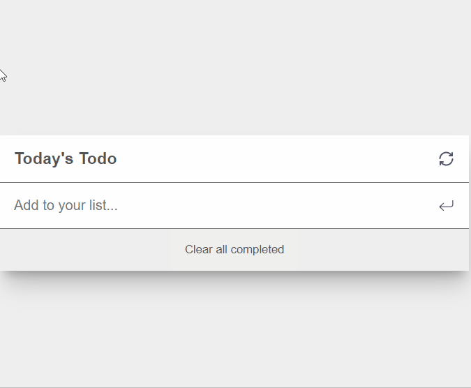

# Todo app 

This is a simple ToDo tasks application built with javascript, and designed with css.

## Live demoe
Here is the [live demo](https://aimalamiri.github.io/Todo-List/) link.

## Technologeis and plugins

- HTML 5
- CSS3
- SCSS
- Javascript
- Webpack

## Getting Started

1. Clone the project by runing the `git clone git@github.com:aimalamiri/Todo-List.git` command in your command line.
2. Run `npm install`
3. Run `npm run dev` for development mode `npm run build` for production mode and `npm run start` for runing the web server.

## Authors

👤 **Aimal Amiri**

- GitHub: [@githubhandle](https://github.com/aimalamiri)
- Twitter: [@twitterhandle](https://twitter.com/Aimalamiri)
- LinkedIn: [LinkedIn](https://linkedin.com/in/aimal-amiri)

## 🤝 Contributing

Contributions, issues, and feature requests are welcome!

Feel free to check the [issues page](../../issues/).

## Show your support

Give a ⭐️ if you like this project!

## 📝 License

This project is [MIT](./MIT.md) licensed.
